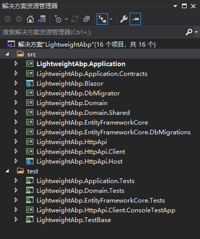
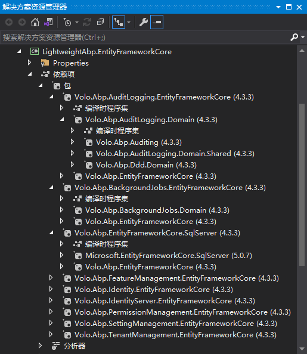
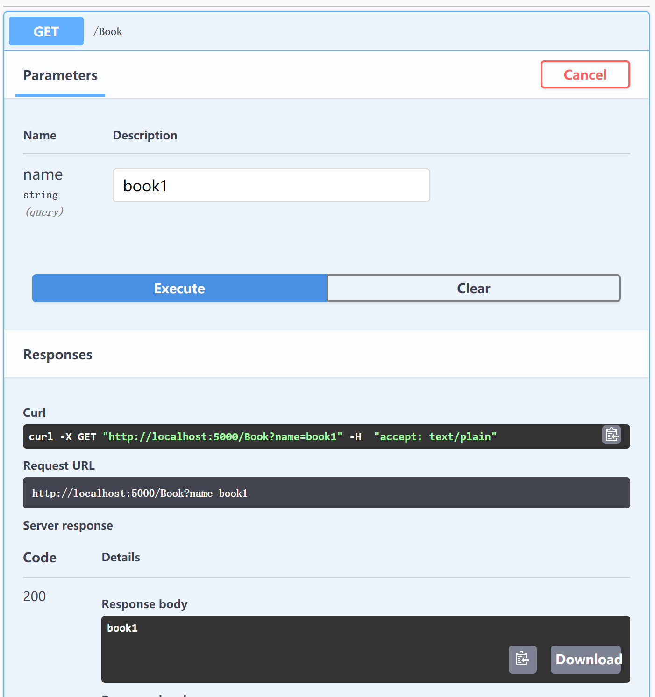

在进行框架的选型时，经常会听到“***框架太重了”之类的声音，比如“Abp太重了，不适合我们...”。事实上，Abp框架真的很重吗？

框架的“轻”和“重”，我没有在网上找到明确的定义，通过阅读一些技术博客，大致可以把框架的“轻”和“重”通过以下几个方面进行区分：

- 所依赖程序集的数量
- 所实现的功能的多少
- 上手难度及易用性

“轻量级”的框架，大概指的是一个程序集依赖少且程序集文件小、功能虽少但足够满足需求、上手容易使用简单的框架；“重量级”的框架，大概指的是一个程序集依赖多且程序集文件大、功能丰富但大多数用不到、上手困难且使用困难的框架。

这篇文章将从上述几个方面来探索Abp是一个“轻量级”还是“重量级”的框架。

## 最小依赖

Abp开发了一些启动模板来为我们生成项目。启动模板采用了[领域驱动设计](https://docs.abp.io/en/abp/latest/Domain-Driven-Design)的分层方案来建立项目层级，包括了**展示层**、**应用层**、**领域层**与**基础设施层**。



我们通常都会通过[Abp CLI](https://docs.abp.io/en/abp/latest/CLI)或Abp.io来创建类似上图架构的项目。Abp为我们生成的项目，减少了我们初始化项目的工作量，开箱即用，因此将我们可能会使用的Nuget包预先引入到我们的项目中，也就给我们一种依赖项太多的感觉。



从架构设计上来讲，**模块化**是Abp的核心；而从技术角度来看，**依赖注入**则是Abp实现众多功能的一个主要手段。只要了解Abp的**模块化**和**依赖注入**，我们就能够基于Abp框架来进行项目开发。

接下来将创建一个原生的`ASP.NET Core Web API`项目，围绕**模块化**和**依赖注入**两个核心概念，来展示如何以最小依赖的方式使用Abp。

- 通过VS或者dotNet cli新建一个原生的`ASP.NET Core Web API`项目，命名为`LightweightAbp`；
- 安装Nuget包`Volo.Abp.Autofac`和`Volo.Abp.AspNetCore.Mvc`；
- 将项目进行**模块化**：在项目根目录新建一个Abp**模块**代码文件`LightweightAbpModule.cs`，并复制以下代码：

```C#
[DependsOn(
    typeof(AbpAutofacModule),
    typeof(AbpAspNetCoreMvcModule))]
public class LightweightAbpModule : AbpModule
{
    public override void ConfigureServices(ServiceConfigurationContext context)
    {
    }

    public override void OnApplicationInitialization(ApplicationInitializationContext context)
    {
    }
}
```

- 将`Startup`中的代码调整到`LightweightAbpModule`中，代码如下：

``` C#
[DependsOn(
    typeof(AbpAutofacModule),
    typeof(AbpAspNetCoreMvcModule))]
public class LightweightAbpModule : AbpModule
{
    public override void ConfigureServices(ServiceConfigurationContext context)
    {
        context.Services.AddControllers();
        context.Services.AddSwaggerGen(c =>
        {
            c.SwaggerDoc("v1", new OpenApiInfo { Title = "LightweightAbp", Version = "v1" });
        });
    }

    public override void OnApplicationInitialization(ApplicationInitializationContext context)
    {
        var app = context.GetApplicationBuilder();
        var env = context.GetEnvironment();

        if (env.IsDevelopment())
        {
            app.UseDeveloperExceptionPage();
            app.UseSwagger();
            app.UseSwaggerUI(c => c.SwaggerEndpoint("/swagger/v1/swagger.json", "LightweightAbp v1"));
        }

        app.UseRouting();

        app.UseAuthorization();

        app.UseEndpoints(endpoints =>
        {
            endpoints.MapControllers();
        });
    }
}

```

- 更改`Startup`中的代码以使用Abp的**模块化**系统：

``` C#
public class Startup
{
    public void ConfigureServices(IServiceCollection services)
    {
        services.AddApplication<LightweightAbpModule>();
    }

    public void Configure(IApplicationBuilder app, IWebHostEnvironment env, ILoggerFactory loggerFactory)
    {
        app.InitializeApplication();
    }
}
```

- 更改`Program`的`CreateHostBuilder`方法以使用Abp的**依赖注入**系统（基于Autofac）：

``` C#
public static IHostBuilder CreateHostBuilder(string[] args) =>
            Host.CreateDefaultBuilder(args)
                .ConfigureWebHostDefaults(webBuilder =>
                {
                    webBuilder.UseStartup<Startup>();
                })
                .UseAutofac();
```

- 将项目生成的`WeatherForecastController`基类`ControllerBase`更改为`AbpController`。
- 按`F5`运行。

至此项目的创建完成了。可以看到，仅仅依赖了`Volo.Abp.Autofac`和`Volo.Abp.AspNetCore.Mvc`两个Nuget包，即可利用Abp进行开发。若从所依赖Nuget包数量来评估框架的“轻”和“重”，那么Abp不可谓不轻。

## 功能按需使用

得益于**模块化**设计，Abp将其所能提供的功能，划分并封装到了不同的**模块**中。要想使用Abp提供的某一功能，只需引入相关的Nuget包并依赖（`DependsOn`）模块即可。

### 数据访问

要想实现数据访问功能，首先我们需要定义`Entity`、`DbContext`并配置数据库支持。在Abp的层次架构中，`Entity`、`Repository`属于领域层，`Service`属于应用层，`DbContext`则属于`EntityFramework Core`模块，因此我们按需引入所需模块即可。

- 安装Nuget包`Volo.Abp.Ddd.Application`、`Volo.Abp.Ddd.Domain`和`Volo.Abp.EntityFrameworkCore.Sqlite`；
- 在`LightweightAbpModule`类中配置`DependsOn`特性，将`AbpDddApplicationModule`、`AbpDddDomainModule`和`AbpEntityFrameworkCoreSqliteModule`模块依赖到我们的项目模块中。

``` C#
    [DependsOn(
        typeof(AbpAutofacModule),
        typeof(AbpAspNetCoreMvcModule),
        typeof(AbpDddApplicationModule),
        typeof(AbpDddDomainModule),
        typeof(AbpEntityFrameworkCoreSqliteModule))]
    public class LightweightAbpModule : AbpModule
    { ... }
```

- 然后创建实体`Book`及数据库上下文`LightweightAbpDbContext`:

``` C#
using System;
using Volo.Abp.Domain.Entities;

namespace LightweightAbp
{
    public class Book : Entity<Guid>
    {
        public string Name { get; set; }
    }
}

```

``` C#
[ConnectionStringName("Default")]
public class LightweightAbpDbContext : AbpDbContext<LightweightAbpDbContext>
{
    public LightweightAbpDbContext(DbContextOptions<LightweightAbpDbContext> options)
        : base(options)
    { }

    public DbSet<Book> Books { get; set; }

    protected override void OnModelCreating(ModelBuilder builder)
    {
        base.OnModelCreating(builder);

        builder.Entity<Book>(b =>
        {
            b.ToTable(nameof(Books));
        });
    }
}
```

- 在`LightweightAbpModule`的`ConfigureServices`方法中配置数据库访问：

``` C#
public override void ConfigureServices(ServiceConfigurationContext context)
{
    ...

    context.Services.AddAbpDbContext<LightweightAbpDbContext>(options =>
    {
        options.AddDefaultRepositories(includeAllEntities: true);
    });

    Configure<AbpDbContextOptions>(options =>
    {
        options.UseSqlite();
    });
}
```

- 在`appsettings.json`中配置数据库连接字符串

``` json
{
  ...
  "ConnectionStrings": {
    "Default": "Data Source=LightweightAbp.db"
  }
}
```

- 安装Nuget包"Microsoft.EntityFrameworkCore.Tools",并在在项目根目录下打开命令行工具，依次执行以下命令进行数据迁移和数据库更新：

``` cmd
dotnet ef migrations add InitialCreate
dotnet ef database update
```

- 创建`IBookAppService`及`BookAppService`:

``` C#
public interface IBookAppService
{
    Task CreateAsync(string name);
}
```

``` C#
public class BookAppService : ApplicationService, IBookAppService
{
    public IRepository<Book, Guid> Repository => LazyServiceProvider.LazyGetRequiredService<IRepository<Book, Guid>>();

    public async Task<string> CreateAsync(string name)
    {
        var book = await Repository.InsertAsync(new Book()
        {
            Name = name
        });

        return book.Name;
    }
}
```

- 在文件夹Controllers中创建`BookController`:

``` C#
[ApiController]
[Route("[controller]")]
public class BookController : AbpController
{
    private readonly IBookAppService _service;

    public BookController(IBookAppService service)
    {
        _service = service;
    }

    [HttpGet]
    public Task<string> CreateAsync(string name)
    {
        return _service.CreateAsync(name);
    }
}
```

- *F5*以调试模式运行即可在Swagger页面上插入数据：



这里我们实现了简单的数据插入。可以看到，项目中并没有使用复杂架构和复杂的领域驱动设计，仅引用并配置Abp模块，即可使用常规的 `ASP.NET Core Web API`方式进行开发。

### 缓存

接下来我们将继续实现缓存功能。

- 引用Nuget包`Volo.Abp.Caching`并向`LightweightAbpModule`添加`AbpCachingModule`模块依赖；
- 修改`IBookAppService`及`BookAppService`实现`GetAllAsync`方法：

``` C#
public interface IBookAppService
{
    Task<string> CreateAsync(string name);

    Task<string[]> GetAllAsync();
}
```

``` C#
public class BookAppService : ApplicationService, IBookAppService
{
    private readonly IRepository<Book, Guid> _repository;
    private readonly IDistributedCache<string[]> _cache;

    public BookAppService(
        IRepository<Book, Guid> repository,
        IDistributedCache<string[]> cache)
    {
        _repository = repository;
        _cache = cache;
    }

    public async Task<string> CreateAsync(string name)
    { ... }

    public async Task<string[]> GetAllAsync()
    {
        return await _cache.GetOrAddAsync(
            "AllBooksName",
            async () => await _repository.Select(b => b.Name).ToArrayAsync(),
            () => new DistributedCacheEntryOptions
            {
                AbsoluteExpiration = DateTimeOffset.Now.AddHours(1)
            }
        );
    }
}
```

- 修改`BookAppService`实现`GetAllAsync`API接口：

``` C#
public class BookController : AbpController
{
    ...

    [HttpGet("all")]
    public Task<string[]> GetAllAsync()
    {
        return _service.GetAllAsync();
    }
}
```

- *F5*以调试方式运行，即可调用实现了缓存功能的`GetAllAsync`接口。

这里我们实现了缓存功能。显而易见，按需使用缓存功能所在的Nuget包及模块即可，并没有很多繁杂的操作。

众所周知，Abp实现了相当多的功能，其中有些功能也许整个项目生命周期中都不会用到。得益于**模块化**的方式，我们可以只依赖我所需要的Nuget包和Abp模块。如果根据功能多少来评判框架的“轻”和“重”，我们按需依赖不同模块时Abp框架不可谓不轻。由此可见，一个框架的“轻”和“重”，有时还会取决于使用方式。

## 上手难度及易用性

学习一门新技术最好的起点便是官方文档，Abp也是如此，Abp的官方文档非常详尽介绍了各个功能。Abp还为我们提供了启动模板，模板遵循了领域驱动设计的最佳实践来进行项目分层，并且为我们继承了很多项目中常用的功能模块。

对于初学者而言，面对一个复杂的分层架构及丰富的功能特性支持，一瞬间需要接受非常多的知识，因此会产生无从下手的感觉，进而得出一种上手难度高，框架很“重”的结论。

如果从另外一种角度来学习Abp的话，也许情况会有所不同。在本文之初，我便提出了Abp的核心是**模块化**及**依赖注入**的观点，当我们将入门的重点放在**模块化**和**依赖注入**上，那么会发现Abp是一个极易上手并且学习曲线很平缓的框架。正如上文我所进行的代码演示，如果感觉这个演示项目简单易学，那么就证明了我这一观点。

至于易用性，首先Abp实现的功能很全面，我们可以按需使用；其次，随着对Abp框架的逐步深入，会发现**模块化**的设计让我们的项目集成多种功能变得简单，并且随着项目的演进，Abp的**模块化**给我们提供了轻易切换到微服务方案的能力；**依赖注入**系统让我们能够轻易的定制并替换Abp默认实现的功能。因此，我认为Abp是一个易于使用的框架。

## 总结

在这里我们从一个不同的角度来认识了Abp框架，显而易见，对于Abp来讲，是否太“重”，和我们对他的认知及使用方式有很大的关联。

项目示例代码将托管在[Github](https://github.com/realZhangChi/LightweightAbp)中。
